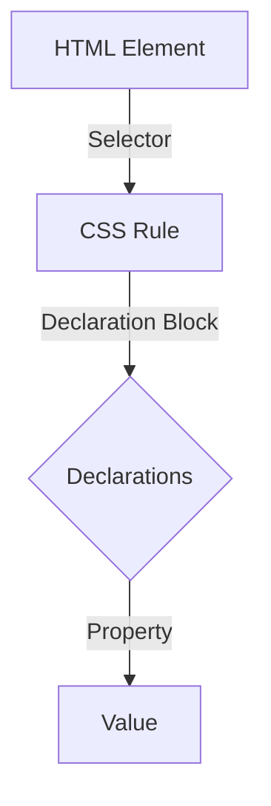

### Session Plan: Styling Text with CSS – Making Words Look Awesome! ✍️

#### Session Objectives:
- Understand basic CSS syntax.
- Learn how to style text using CSS.
- Apply various CSS properties to make text look visually appealing.

#### Session Outline:
1. Introduction to CSS
2. Basic CSS Syntax
3. Styling Text with CSS
    - Changing font family
    - Changing font size
    - Changing text color
    - Text alignment
    - Text decoration
    - Font weight and style
4. Hands-On Activity
5. Q&A and Wrap-Up

---

## 1. Introduction to CSS

CSS stands for Cascading Style Sheets. It is used to describe how HTML elements should be displayed on the screen. CSS makes it easy to add styles like colors, fonts, and spacing to your web pages.

### Example:
```html
<!DOCTYPE html>
<html>
<head>
    <style>
        body {
            font-family: Arial, sans-serif;
        }
    </style>
</head>
<body>
    <h1>Hello, world!</h1>
    <p>Welcome to your first CSS lesson.</p>
</body>
</html>
```

---

## 2. Basic CSS Syntax

CSS is made up of rules. Each rule has a selector and a declaration block. The selector points to the HTML element you want to style. The declaration block contains one or more declarations separated by semicolons.

### Example:
```css
h1 {
    color: blue;
    font-size: 24px;
}
```

In this example, `h1` is the selector, and `color: blue; font-size: 24px;` are the declarations.

### Mermaid Diagram:


---

## 3. Styling Text with CSS

### Changing Font Family
You can change the font of your text using the `font-family` property.

```css
p {
    font-family: 'Comic Sans MS', cursive, sans-serif;
}
```

### Changing Font Size
Use the `font-size` property to adjust the size of your text.

```css
h1 {
    font-size: 32px;
}
```

### Changing Text Color
The `color` property changes the color of your text.

```css
h2 {
    color: green;
}
```

### Text Alignment
Align your text with the `text-align` property.

```css
p {
    text-align: center;
}
```

### Text Decoration
Add decorations to your text like underline, overline, or line-through using the `text-decoration` property.

```css
a {
    text-decoration: underline;
}
```

### Font Weight and Style
Use `font-weight` to make text bold, and `font-style` to italicize text.

```css
strong {
    font-weight: bold;
}

em {
    font-style: italic;
}
```

---

## 4. Hands-On Activity

### Task: Style the following HTML using CSS

```html
<!DOCTYPE html>
<html>
<head>
    <style>
        /* Add your CSS here */
    </style>
</head>
<body>
    <h1>My Awesome Website</h1>
    <p>This is a paragraph that needs some styling!</p>
    <a href="#">This is a link</a>
</body>
</html>
```

### Instructions:
1. Change the font family of the entire page to Arial.
2. Set the `h1` color to blue and font size to 30px.
3. Center align the paragraph text.
4. Underline the link.

---

## 5. Q&A and Wrap-Up

Feel free to ask any questions you have about CSS or today's lesson. Remember, practice makes perfect, so keep experimenting with different CSS properties!

---

### Summary:
In this session, we learned about CSS and how to style text. We covered font families, font sizes, text colors, alignments, decorations, and more. Keep practicing to make your websites look awesome!

---

