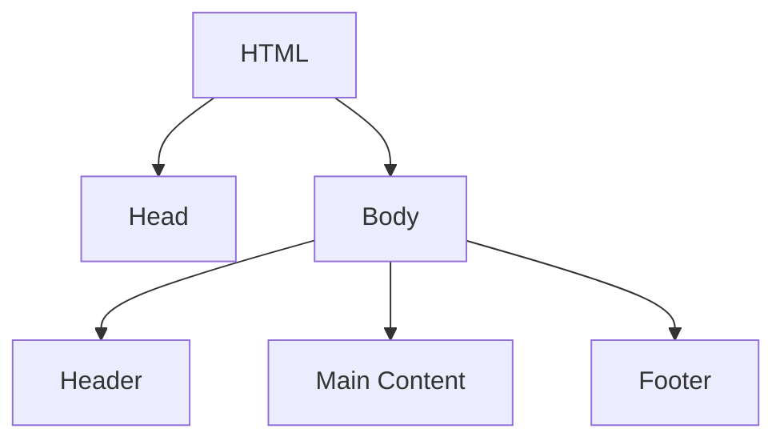
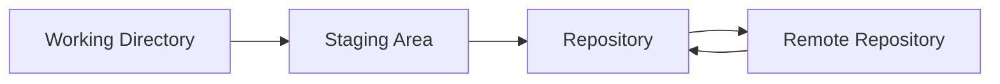
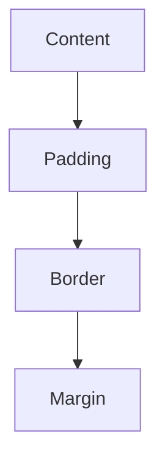

# Review: Web Building Basics! 🧩

## 1. The Web: Your Playground! 🌐

### How Websites Work
Websites are made up of files stored on servers. When you visit a website, your browser fetches these files and displays them for you. Websites are built using HTML, CSS, and JavaScript.


### Why Websites Are Important
Websites allow us to share information, communicate, and create online communities. They are essential in today's digital world for both personal and professional purposes.

## 2. Coding Tools: Your Magic Wand! 🛠️

### Setting Up Your Coding Environment
We use code editors like Visual Studio Code to write and edit our code. It's important to have the right tools to make coding easier and more efficient.


## 3. GitHub Pages: Your Website's Home! 🏠

### Hosting Your Website for Free
GitHub Pages lets you host your website for free. You can create a repository, add your website files, and publish them online with just a few steps.


## 4. HTML: The Building Blocks of Your Website! 🧱

### HTML Tags
HTML uses tags to structure content on a webpage. Common tags include headings (`<h1>` to `<h6>`), paragraphs (`<p>`), and lists (`<ul>`, `<ol>`, and `<li>`).

```html
<h1>Welcome to My Website</h1>
<p>This is a paragraph of text.</p>
<ul>
  <li>Item 1</li>
  <li>Item 2</li>
</ul>
```


## 5. CSS: Dress Up Your Website! 🎨

### Styling Your Website
CSS is used to style your HTML elements. You can change colors, fonts, and layouts to make your website look amazing.

```css
body {
  background-color: #f0f0f0;
  font-family: Arial, sans-serif;
}
h1 {
  color: #333;
}
```


## 6. Project 1: About Me Page! 😎

### Creating Your First Webpage
You created an "About Me" page, introducing yourself to the world. This project helped you practice HTML and CSS basics.

## 7. Git: Your Website's Time Machine! ⏰

### Tracking Changes
Git helps you keep track of changes to your code. You can save different versions of your project and go back to previous versions if needed.


## 8. More HTML: Links and Images! 🔗 🖼️

### Adding Links and Images
You learned how to add links (`<a>`) to other pages and images (``) to your website.

```html
<a href="https://www.example.com">Visit Example</a>

```


## 9. More CSS: Design Like a Pro! ✨

### Advanced CSS Techniques
We explored advanced CSS techniques like layouts, positioning, and cool effects to make your website stand out.

```css
.container {
  display: flex;
  justify-content: space-between;
}
```


## 10. Project 2: Your Favorite Things Page! ⭐

### Showcasing Your Interests
In your second project, you created a webpage about your favorite things, using the HTML and CSS skills you've learned.

## 11. GitHub Pages: Sharing Your Creation! 📢

### Publishing Your Website
You learned how to publish your website on GitHub Pages, making it available for everyone to see.

---

## Review with Mermaid Diagrams

### Website Structure


### Git Workflow


### CSS Box Model


---

## Wrap-Up
In this session, we reviewed the basics of web building, including how websites work, the tools we use, and the essential elements of HTML and CSS. Remember, practice makes perfect! Keep experimenting with your projects and applying what you've learned.

### Next Session: JavaScript Basics: Make Your Website Interactive! 🚀

---
