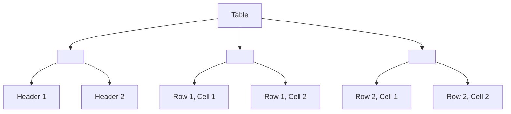

# Session 12: HTML Tables: Organizing Information! 📊

## Objectives
By the end of this session, students will be able to:
- Understand the structure of HTML tables.
- Create tables to display data in rows and columns.
- Style tables with basic CSS.

## Introduction to HTML Tables
HTML tables allow you to organize data into rows and columns. They are great for displaying structured information like schedules, prices, or any data that fits a grid format.

### Basic Table Structure
An HTML table is created using the `<table>` element. Inside the table, we define rows with `<tr>` (table row) and columns with `<td>` (table data). 

Here’s a simple example:
```html
<table>
  <tr>
    <td>Row 1, Cell 1</td>
    <td>Row 1, Cell 2</td>
  </tr>
  <tr>
    <td>Row 2, Cell 1</td>
    <td>Row 2, Cell 2</td>
  </tr>
</table>
```

### Adding Table Headers
To add headers to your table, use the `<th>` (table header) element inside a `<tr>`.

```html
<table>
  <tr>
    <th>Header 1</th>
    <th>Header 2</th>
  </tr>
  <tr>
    <td>Row 1, Cell 1</td>
    <td>Row 1, Cell 2</td>
  </tr>
  <tr>
    <td>Row 2, Cell 1</td>
    <td>Row 2, Cell 2</td>
  </tr>
</table>
```

### Example Table: Class Schedule
```html
<table border="1">
  <tr>
    <th>Day</th>
    <th>Subject</th>
    <th>Time</th>
  </tr>
  <tr>
    <td>Monday</td>
    <td>Math</td>
    <td>9:00 AM - 10:00 AM</td>
  </tr>
  <tr>
    <td>Tuesday</td>
    <td>Science</td>
    <td>10:00 AM - 11:00 AM</td>
  </tr>
  <tr>
    <td>Wednesday</td>
    <td>History</td>
    <td>11:00 AM - 12:00 PM</td>
  </tr>
</table>
```

### Adding Style to Your Table
You can make your tables look better with some basic CSS.

```html
<style>
  table {
    width: 100%;
    border-collapse: collapse;
  }
  th, td {
    border: 1px solid black;
    padding: 8px;
    text-align: left;
  }
  th {
    background-color: #f2f2f2;
  }
</style>

<table>
  <tr>
    <th>Day</th>
    <th>Subject</th>
    <th>Time</th>
  </tr>
  <tr>
    <td>Monday</td>
    <td>Math</td>
    <td>9:00 AM - 10:00 AM</td>
  </tr>
  <tr>
    <td>Tuesday</td>
    <td>Science</td>
    <td>10:00 AM - 11:00 AM</td>
  </tr>
  <tr>
    <td>Wednesday</td>
    <td>History</td>
    <td>11:00 AM - 12:00 PM</td>
  </tr>
</table>
```

## Activity: Creating Your Own Table
1. Ask students to create a table for their weekly homework schedule.
2. They should include the following columns: Day, Subject, Homework Task, and Due Date.

## Example Output
```html
<table>
  <tr>
    <th>Day</th>
    <th>Subject</th>
    <th>Homework Task</th>
    <th>Due Date</th>
  </tr>
  <tr>
    <td>Monday</td>
    <td>Math</td>
    <td>Exercise 5</td>
    <td>Tuesday</td>
  </tr>
  <tr>
    <td>Tuesday</td>
    <td>Science</td>
    <td>Read Chapter 3</td>
    <td>Wednesday</td>
  </tr>
  <tr>
    <td>Wednesday</td>
    <td>History</td>
    <td>Write an Essay</td>
    <td>Thursday</td>
  </tr>
</table>
```

## Visual Aid: Table Structure Diagram
Let's add a diagram to visualize the structure of an HTML table.




## Wrap-Up
- Review the key elements: `<table>`, `<tr>`, `<th>`, and `<td>`.
- Highlight the importance of organizing data clearly.
- Encourage students to experiment with different table structures and styles.
