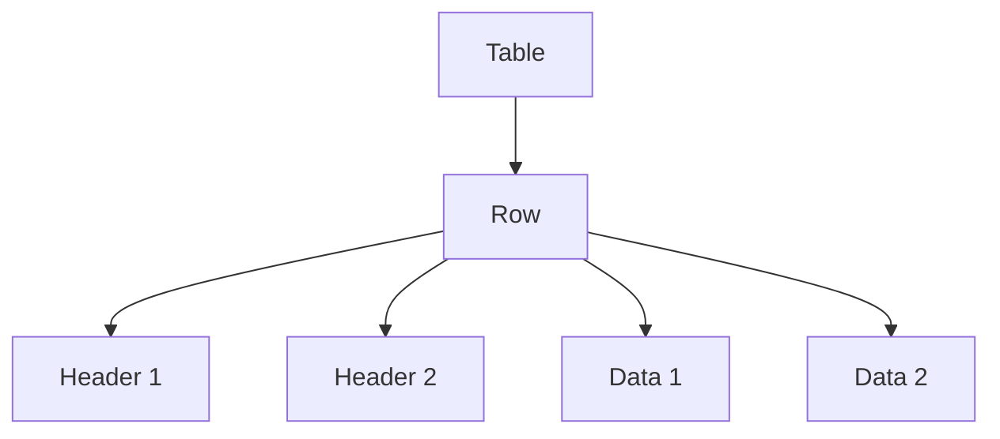

## Session: HTML Tables - Organizing Information! 📊

### Objective:
By the end of this session, students will be able to create tables in HTML to display data in rows and columns.

---

### Introduction to HTML Tables

HTML tables are a way to organize information into rows and columns. They are especially useful for displaying data in a structured format.

---

### Basic Structure of an HTML Table

An HTML table is defined with the `<table>` tag. Each table row is defined with the `<tr>` tag. A table header is defined with the `<th>` tag. A table data/cell is defined with the `<td>` tag.

#### Example:

```html
<table>
  <tr>
    <th>Header 1</th>
    <th>Header 2</th>
  </tr>
  <tr>
    <td>Data 1</td>
    <td>Data 2</td>
  </tr>
  <tr>
    <td>Data 3</td>
    <td>Data 4</td>
  </tr>
</table>
```

---

### Creating Your First Table

Let's create a simple table that lists your favorite books.

```html
<table>
  <tr>
    <th>Title</th>
    <th>Author</th>
  </tr>
  <tr>
    <td>Harry Potter</td>
    <td>J.K. Rowling</td>
  </tr>
  <tr>
    <td>The Hobbit</td>
    <td>J.R.R. Tolkien</td>
  </tr>
</table>
```

---

### Adding Borders and Styling to Tables

You can add borders to your table to make it look more structured.

```html
<table border="1">
  <tr>
    <th>Title</th>
    <th>Author</th>
  </tr>
  <tr>
    <td>Harry Potter</td>
    <td>J.K. Rowling</td>
  </tr>
  <tr>
    <td>The Hobbit</td>
    <td>J.R.R. Tolkien</td>
  </tr>
</table>
```

---

### Advanced Table Features

#### 1. Merging Cells

You can merge cells using the `colspan` and `rowspan` attributes.

```html
<table border="1">
  <tr>
    <th colspan="2">Title</th>
  </tr>
  <tr>
    <td rowspan="2">The Hobbit</td>
    <td>J.R.R. Tolkien</td>
  </tr>
  <tr>
    <td>1937</td>
  </tr>
</table>
```

#### 2. Adding a Table Caption

You can add a caption to your table to describe its content.

```html
<table border="1">
  <caption>Favorite Books</caption>
  <tr>
    <th>Title</th>
    <th>Author</th>
  </tr>
  <tr>
    <td>Harry Potter</td>
    <td>J.K. Rowling</td>
  </tr>
  <tr>
    <td>The Hobbit</td>
    <td>J.R.R. Tolkien</td>
  </tr>
</table>
```

---

### Interactive Exercise

1. **Create a Table**: Create a table that lists your three favorite movies, their directors, and release years.
2. **Add Styling**: Add a border to your table and style the headers.
3. **Merge Cells**: Try merging some cells using `colspan` or `rowspan`.

### Example Exercise Solution

```html
<table border="1">
  <caption>Favorite Movies</caption>
  <tr>
    <th>Title</th>
    <th>Director</th>
    <th>Year</th>
  </tr>
  <tr>
    <td>The Lion King</td>
    <td>Jon Favreau</td>
    <td>2019</td>
  </tr>
  <tr>
    <td rowspan="2">Inception</td>
    <td>Christopher Nolan</td>
    <td>2010</td>
  </tr>
  <tr>
    <td>Interstellar</td>
    <td>Christopher Nolan</td>
    <td>2014</td>
  </tr>
</table>
```

---

### Visualizing Tables with Mermaid Diagrams

Mermaid diagrams can help visualize table structures.



---

### Conclusion

HTML tables are a powerful tool to organize and display data. With the basics covered, you can now create and style your tables to make your data more presentable.

---

### Homework

1. **Create a Personal Schedule**: Make a table that represents your weekly schedule.
2. **Style It**: Add borders and a caption to your table.
3. **Experiment**: Use `colspan` and `rowspan` to merge cells where needed.

---

### Resources

- [W3Schools HTML Tables Tutorial](https://www.w3schools.com/html/html_tables.asp)
- [MDN Web Docs - HTML Tables](https://developer.mozilla.org/en-US/docs/Web/HTML/Element/table)

---

Happy coding! 🎉
