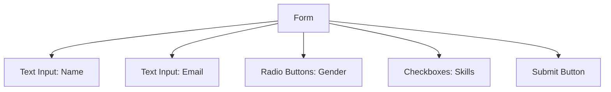

# Session 14: HTML Forms - Get Interactive! 📝

In this session, we'll learn how to build forms to collect information from your website visitors. Forms are an essential part of web development, allowing users to input data and interact with your website. Let's dive in!

## Objectives
By the end of this session, you will:
- Understand the basic structure of an HTML form.
- Learn how to use various form elements like text fields, radio buttons, checkboxes, and submit buttons.
- Create a simple form to collect user information.

## 1. Introduction to HTML Forms
HTML forms are used to collect user input. The form element wraps the entire form, and various input elements are used within it to create different fields.

### Basic Structure of a Form
```html
<form action="/submit_form" method="post">
  <!-- Form elements go here -->
</form>
```

### Explanation:
- `<form>`: The container for the form elements.
- `action`: The URL where the form data will be sent.
- `method`: The HTTP method to use when sending form data (`get` or `post`).

## 2. Common Form Elements

### Text Input
Used to collect a single line of text.

```html
<label for="name">Name:</label>
<input type="text" id="name" name="name">
```

### Radio Buttons
Used to select one option from a set.

```html
<p>Gender:</p>
<input type="radio" id="male" name="gender" value="male">
<label for="male">Male</label><br>
<input type="radio" id="female" name="gender" value="female">
<label for="female">Female</label>
```

### Checkboxes
Used to select multiple options.

```html
<p>Skills:</p>
<input type="checkbox" id="html" name="skills" value="html">
<label for="html">HTML</label><br>
<input type="checkbox" id="css" name="skills" value="css">
<label for="css">CSS</label><br>
<input type="checkbox" id="js" name="skills" value="javascript">
<label for="js">JavaScript</label>
```

### Submit Button
Used to submit the form.

```html
<input type="submit" value="Submit">
```

## 3. Building a Simple Contact Form

Let's put it all together to create a simple contact form.

```html
<form action="/submit_contact" method="post">
  <label for="name">Name:</label>
  <input type="text" id="name" name="name"><br><br>

  <label for="email">Email:</label>
  <input type="email" id="email" name="email"><br><br>

  <p>Gender:</p>
  <input type="radio" id="male" name="gender" value="male">
  <label for="male">Male</label><br>
  <input type="radio" id="female" name="gender" value="female">
  <label for="female">Female</label><br><br>

  <p>Skills:</p>
  <input type="checkbox" id="html" name="skills" value="html">
  <label for="html">HTML</label><br>
  <input type="checkbox" id="css" name="skills" value="css">
  <label for="css">CSS</label><br>
  <input type="checkbox" id="js" name="skills" value="javascript">
  <label for="js">JavaScript</label><br><br>

  <input type="submit" value="Submit">
</form>
```

## 4. Mermaid Diagram: Form Structure
Let's visualize the form structure using a Mermaid diagram.



## 5. Practice Time!

Now it's your turn! Try creating a form that asks for:
- Your favorite color (using a dropdown).
- A message (using a textarea).

### Example:
```html
<form action="/submit_favorite" method="post">
  <label for="color">Favorite Color:</label>
  <select id="color" name="color">
    <option value="red">Red</option>
    <option value="green">Green</option>
    <option value="blue">Blue</option>
  </select><br><br>

  <label for="message">Message:</label>
  <textarea id="message" name="message"></textarea><br><br>

  <input type="submit" value="Submit">
</form>
```

## 6. Conclusion
Great job! Today, we learned how to create forms using HTML to collect information from your website visitors. Forms are powerful tools for making your website interactive and user-friendly.

In the next session, we'll learn how to style our forms with CSS to make them look even better!
